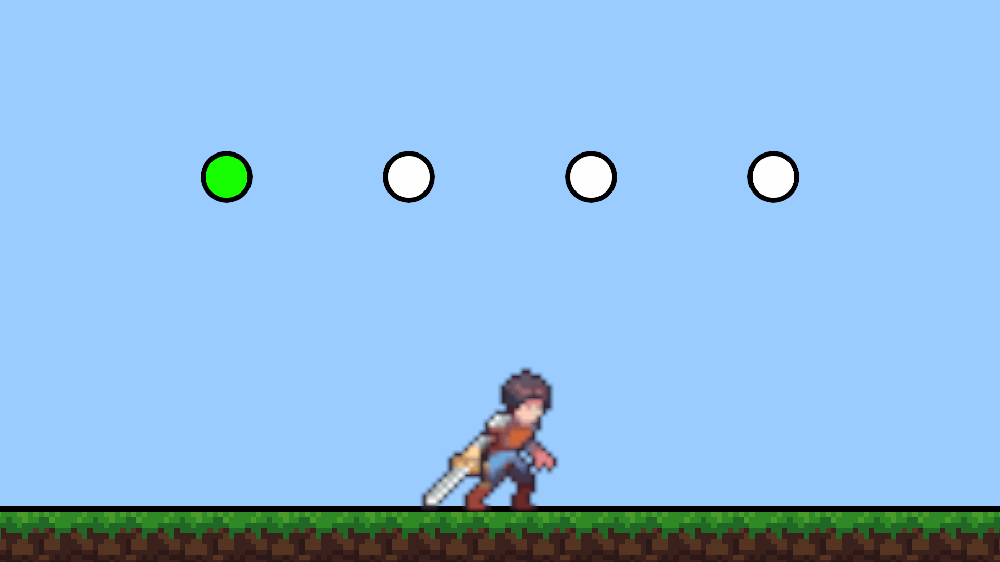
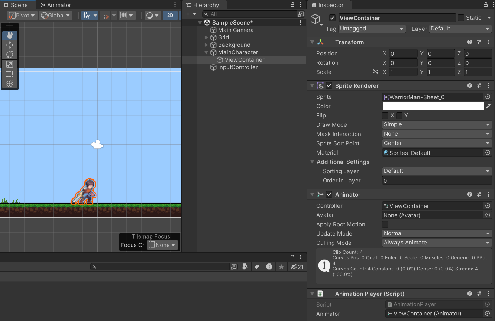
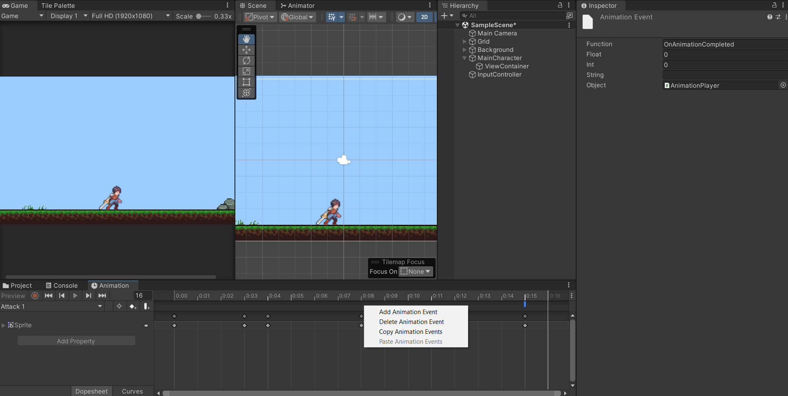
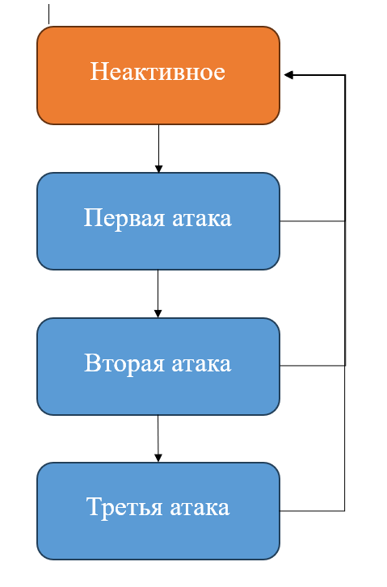
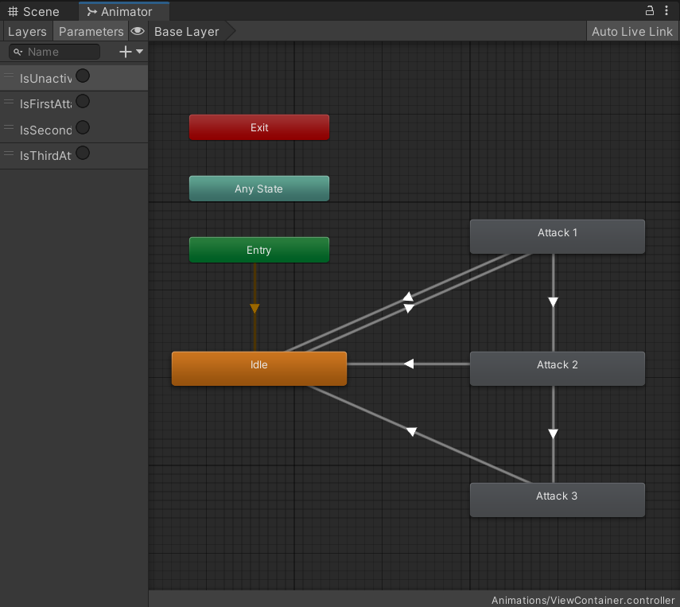

# COMBO ATTACK SYSTEM

<div align="center">
    <p><em>Гибкая и расширяемая система комбо-атак для 2D и 3D проектов.</em></p>
    
</div>

## Описание
Система комбо-атаки разработана на базе машины состояний, которую также можно использовать и в других проектах. В проекте реализованы четыре состояния атаки, включая неактивное, но Вы легко можете реализовать любое другое их количество.

## Благодарность
Хочу сказать огромное спасибо моему другу и ревьюеру с предыдущего места работы, Артёму, за то, что когда-то научил меня пользоваться машиной состояний. Твой вклад в мою деятельность неоценим.

## Как использовать
Для полного понимания работы системы комбо-атаки рекомендую для начала ознакомиться с теорией работы машины состояний.

Прежде всего, в Вашем проекте на сцене должен находиться персонаж "MainCharacter" (названия GameObject даны для удобства). Я использую отображение персонажа "ViewContainer" как дочерний GameObject к самому объекту персонажа, поскольку так я имею больший контроль над точкой вращения персонажа, регулируя отображение относительно родителя. На "ViewContainer" обязательно должны находиться компоненты "Animator" и "AnimationPlayer", - последний Вы найдёте в проекте. Компоненту "AnimationPlayer", в качестве зависимости, передайте упомянутый ранее "Animator".

<div align="center">
    
      <p><em>Расположение элементов в окне Hierarchy</em></p>
</div>

На каждый тип атаки у вас должна быть заготовлена анимация. Я имею ввиду, не состояние, а именно тип. Ваша комбо-атака может состоять из четырёх состояний, но, например, использовать лишь одну атаку, - в таком случае нужна будет лишь одна анимация. Неплохой пример комбинации, содержащей в себе несколько атак одного типа, - последовательность "C-C-C" у персонажа Noob Saibot из UMK3.

<div align="center">
    
      <p><em>Комбо-атака персонажа Noob Saibot. Ultimate Mortal Kombat 3</em></p>
</div>

Заготовив анимации на каждый тип атаки, Вам необходимо добавить в конец каждой их них событие анимации - "Animation Event". Сделать это можно в окне Animation выбранной анимации, нажав ПКМ под таймлайном и выбрав "Add Animation Event". В окне Inspector у "Animation Event" в поле "Function" обязательно введите "OnAnimationCompleted". Таким образом, мы всегда будем знать когда завершилась анимация атаки и вызывать определенный обработчик события из кода проекта, - в нашем случае - метод "OnAnimationCompleted" из класса "AnimationPlayer", который, в свою очередь, так же оповещает подписчиков на своего события OnAnimationCompleted. К полю "Object" вернёмся чуть позже.

<div align="center">
    
      <p><em>Создание Animation Event в окне Animation</em></p>
</div>

Блок-схема системы комбо-атак выглядит следующим образом:

<div align="center">
    
      <p><em>Блок-схема комбо-атаки</em></p>
</div>

Из каждого активного состояния существует переход в неактивное состояние. Помимо этого у каждого промежуточного активного состояния существует переход в следующее активное состояние. Переход между активными состояниями осуществляется при вводе пользователем определенного значения с клавиатуры или любого другого назначенного устройства ввода. Переход в неактивное состояние осуществляется, если пользователь долгое время не вводил это значение.

Теперь перейдём в окно "Animator" Вашего "Animator Controller". Взаимодействие между состояниями должно повторять блок-схему описанную выше. Для каждого состояния должен существовать параметр - триггер, который будет служить причиной перехода из одного состояния в другое. Хэш-код для каждого нового параметра необходимо добавить в скрипт "PlayerAnimations". После по этому хэш-коду в классе состояния будет вызываться переход из одного состояния "Animator Controller" в другое. Основываясь на примере уже готового решения "Animator Controller", Вы можете добавить больше атак в комбинацию. Теперь, если класс AnimationPlayer и Animator являются компонентами одного GameObject (в нашем случае это "ViewContainer"), то поле "Object" у "AnimationEvent" автоматически выберет класс "AnimationPlayer" в качестве зависимости.

<div align="center">
    
      <p><em>Реализация машины состояния в окне Animator</em></p>
</div>


```
public class PlayerAnimations : MonoBehaviour
{
    public static readonly int IsUnactiveAttackState = Animator.StringToHash(nameof(IsUnactiveAttackState));
    public static readonly int IsFirstAttackState = Animator.StringToHash(nameof(IsFirstAttackState));
    public static readonly int IsSecondAttackState = Animator.StringToHash(nameof(IsSecondAttackState));
    public static readonly int IsThirdAttackState = Animator.StringToHash(nameof(IsThirdAttackState));
}
```
<div align="center">
      <p><em>Хэш-коды параметров Animator в классе PlayerAnimations</em></p>
</div>

Чтобы, в конце концов, реализовать логику новой атаки в комбинации, в папке "AttackStateCollection" нужно создать новый скрипт, реализующий класс, который будет являться дочерним к классу "AttackState". В целом, он будет повторять логику активных состояний атак. Единственное различие будет в состояниях, в которое переходит новый вид атаки по своему завершению: если активное состояние последнее в комбинации, то переход в любом случае будет выполнен только в неактивное состояние, если промежуточное - либо в следующее активное, либо в неактивное. В проекте примером последнего состояния является "ThirdAttackState". При добавлении новых состояний, его следует изменить на промежуточное.
Экземпляр класса состояния необходимо будет создать. Для этого в контексте машины состояния - в классе "Attacker" в методе "FillStates" добавьте вызов конструктора нового состояния, передав ему все необходимые зависимости.

```
private void FillStates()
{
  _stateMachine.AddState(new UnactiveAttackState(this, _animationPlayer));
  _stateMachine.AddState(new FirstAttackState(this, _animationPlayer, _timer));
  _stateMachine.AddState(new SecondAttackState(this, _animationPlayer, _timer));
  _stateMachine.AddState(new ThirdAttackState(this, _animationPlayer, _timer));
}
```
<div align="center">
      <p><em>Метод FillStates в классе Attacker, который создаёт экземпляры состояний атаки</em></p>
</div>

Выбор перехода из промежуточного состояния между следующим активным состоянием и неактивным определяется с помощью счетчика нажатий, определенным в классе "Attacker". Каждый раз, когда игрок вводит значение с устройства ввода, счетчик увеличивает своё значение на 1, а когда завершается атака - уменьшает на 1. При значении счетчика равным 0, по завершению анимации атаки, происходит переход в неактивное состояние. Время, которое выделяется игроку на проведение следующей атаки (то есть, на ввод с устройства) в текущем состоянии, регулируется полем "_timeForReset" в классе "Attacker". Сейчас оно ровно одной секунде.

```
if (_attacker.AttackQueueCounter > 0)
  _attacker.SwitchState<SecondAttackState>();
else
  _attacker.SwitchState<UnactiveAttackState>();
```
<div align="center">
      <p><em>Логика выбора перехода в следующее состояние на примере класса FirstAttackState в методе OnAnimationCompleted</em></p>
</div>

За ввод значения с клавиатуры в проекте отвечает класс "InputController", который принимает зависимостью класс "Attacker". Для "InputController" на сцене создан отдельный GameObject. В самом "InputController" значение, которое вводит пользователь с клавиатуры, изменяется при помощи поля "_attackKey", сейчас - это клавиша "J".

Не забудьте передать оставшиеся зависимости на сцене. На GameObject "Main Character" находятся компоненты "Attacker" и "Timer". Вы можете подобрать любую другую удобную архитектуру иерархии, важно передать в сам "Attacker" зависимостями "Timer" и "AnimationPlayer". В свою очередь, сам "Attacker" зависимостью передаётся в "InputController".
