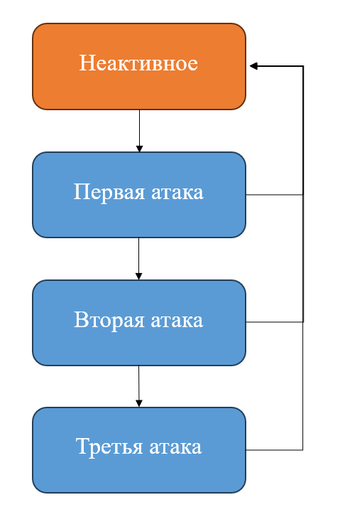

# LIGHT-WEIGHT COMBO ATTACK SYSTEM

<div align="center">
    
</div>

## Описание
Небольшая и простая в освоении система комбо-атаки для 2D и 3D проектов. Основана на машине состояний и может включать любое количество состояний атаки.

## Как использовать
Для работы системы требуется персонаж "MainCharacter" с дочерним объектом "ViewContainer", который отвечает за визуализацию персонажа и содержит компоненты "Animator" и "AnimationPlayer". "Animator" управляет анимациями, а "AnimationPlayer" используется для воспроизведения анимаций. Анимации для каждого типа атаки должны быть подготовлены заранее и соответствовать состояниям, определенным в машине состояний. В конце каждой анимации добавьте событие "Animation Event" с функцией "OnAnimationCompleted" для отслеживания завершения анимации.

Блок-схема системы комбо-атаки, показывающая переходы между состояниями, представлена ниже::

<div align="center">
    
      <p><em>Блок-схема системы комбо-атаки</em></p>
</div>

В "Animator" необходимо настроить триггеры для каждого состояния, которые будут вызывать переходы. Хэш-коды параметров добавляются в скрипт "PlayerAnimations".

```csharp
// Хэш-коды параметров Animator в классе PlayerAnimations
public class PlayerAnimations : MonoBehaviour
{
    public static readonly int IsUnactiveAttackState = Animator.StringToHash(nameof(IsUnactiveAttackState));
    public static readonly int IsFirstAttackState = Animator.StringToHash(nameof(IsFirstAttackState));
    public static readonly int IsSecondAttackState = Animator.StringToHash(nameof(IsSecondAttackState));
    public static readonly int IsThirdAttackState = Animator.StringToHash(nameof(IsThirdAttackState));
}
```

Для реализации нового состояния атаки создайте новый скрипт в папке "AttackStateCollection", наследующий от "AttackState". Этот базовый класс определяет общую логику для всех типов атак. В классе "Attacker" необходимо вызвать конструктор нового созданного класса, чтобы добавить его в машину состояний.

```csharp
// Создание экземпляров состояний комбо-атаки в классе Attacker
private void FillStates()
{
  _stateMachine.AddState(new UnactiveAttackState(this, _animationPlayer));
  _stateMachine.AddState(new FirstAttackState(this, _animationPlayer, _timer));
  _stateMachine.AddState(new SecondAttackState(this, _animationPlayer, _timer));
  _stateMachine.AddState(new ThirdAttackState(this, _animationPlayer, _timer));
}
```

В системе используется таймер "Timer" для управления временем между атаками. Он позволяет ограничить время, в течение которого игрок может вводить команды для выполнения следующей атаки. Значение времени на ввод задается в поле _timeForReset в классе "Attacker" (по умолчанию, 1 секунда). Если игрок не вводит команду в течение этого времени, происходит переход в неактивное состояние.

Переходы между состояниями определяются счетчиком нажатий в классе "Attacker". При вводе значение счетчика увеличивается, а при завершении атаки — уменьшается. Переход в неактивное состояние происходит при значении счетчика, равном 0. Также переход в неактивное состояние осуществляется при достижении игроком максимального количества атак в комбинации.

```csharp
// Логика выбора перехода между состояниями в классе FirstAttackState
if (_attacker.AttackQueueCounter > 0)
    _attacker.SwitchState<SecondAttackState>(); // Переход к следующему состоянию атаки
else
    _attacker.SwitchState<UnactiveAttackState>(); // Переход в неактивное состояние

// Обратите внимание, что эта логика может изменяться в зависимости от типа атаки.
// Для каждого типа атаки может быть своя реализация переходов между состояниями.
```

Класс "InputController" отвечает за ввод с клавиатуры, принимая зависимость от "Attacker" (по умолчанию, клавиша J). На сцене должен быть создан отдельный GameObject для "InputController".

Не забудьте передать все необходимые зависимости в "Attacker", включая "Timer" и "AnimationPlayer".

Если у вас есть вопросы или предложения, свяжитесь со мной через [telegram-канал](https://t.me/de_mock).
